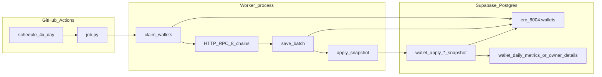
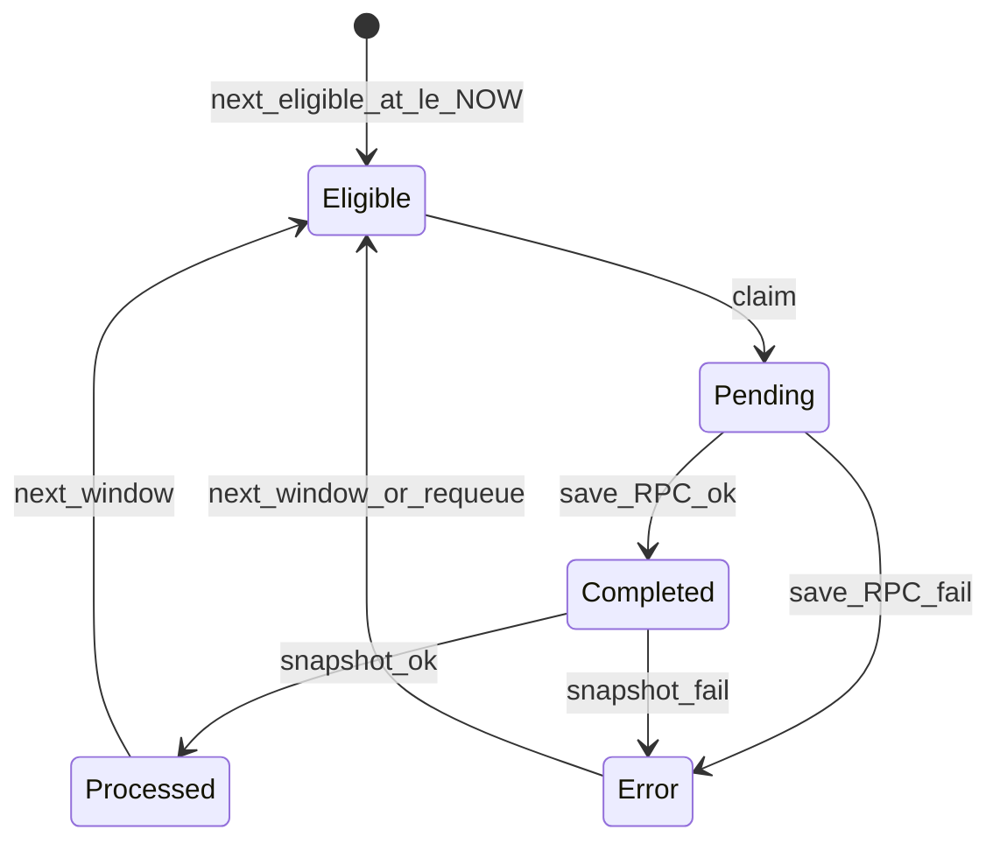
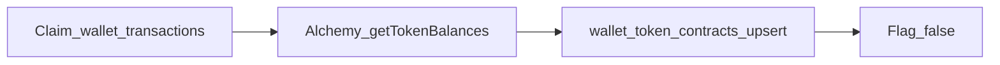
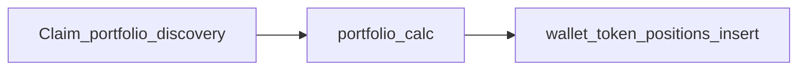
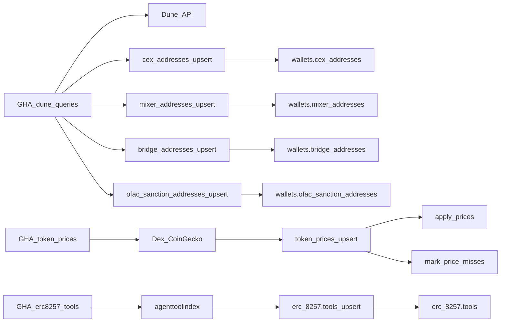
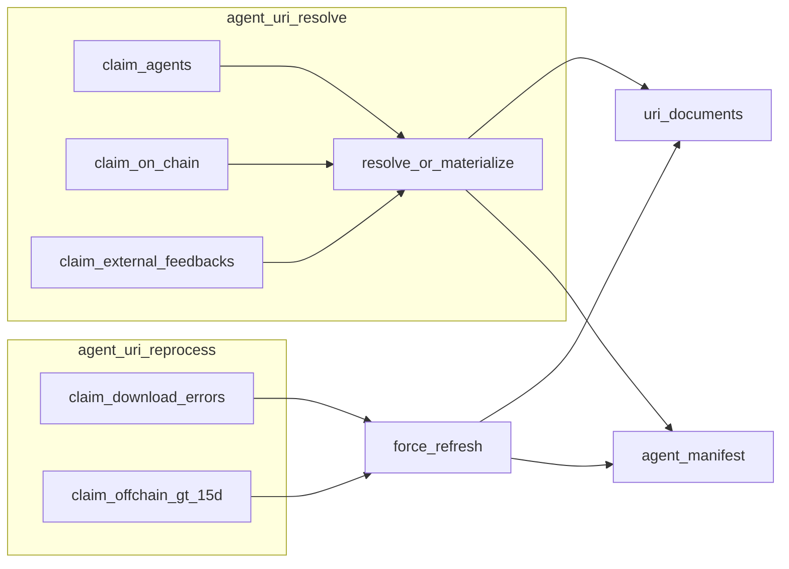

# Architecture

Python batch workers run on **GitHub Actions**, talk to **Supabase Postgres** over a pooler DSN. Wallet jobs finish with an **inline SQL snapshot / upsert** RPC; **URI ingest** writes `uri_documents` + `agent_manifest` directly. There is no Cloudflare Worker or Edge Function in the hot path.

## System diagram



## Common pipeline

Every wallet claim worker loop iteration:

1. **Claim** — `FOR UPDATE SKIP LOCKED` on eligible rows; status `Pending`; bump `next_eligible_at` by `CLAIM_STALE_SECONDS` (default 2h).
2. **RPC** — parallel HTTP (public RPCs → Alchemy) for each claimed wallet.
3. **Save** — batch `UPDATE` JSON + `Completed` or `Error` + schedule next eligibility.
4. **Snapshot** — for each `Completed` id, call `erc_8004.wallet_apply_*_snapshot(wallet_id)` → destination tables + status `Processed`.

**Daily destination (paso 1):** `wallet_apply_daily_snapshot` upserts `erc_8004.wallet_daily_metrics` (`wallet_id`, `chain_id`, `snapshot_date`, `nonce`, `balance`). `snapshot_date` is Postgres `CURRENT_DATE` (DB timezone, typically **UTC**), not the GHA runner local calendar. It does **not** write `wallet_transactions` or `chain_nonces` (rollup later). Discovery workers still claim on `wallet_transactions` using existing rows.

If claim or save/snapshot fails after DB retries, the job **logs and continues** the loop until `MAX_RUNTIME_SECONDS` (wallets left `Pending` are reclaimed after the stale window).

## Status state machine



| Status | Who sets it |
|---|---|
| `Pending` | Worker claim |
| `Completed` / `Error` | Worker save (RPC outcome) |
| `Processed` | Snapshot SQL function |
| `Error` (after Completed) | Worker mark after snapshot failure |

## Workers

| Worker | Workflow | Concurrency group | Parallelism |
|---|---|---|---|
| `wallet_nonce_balance_daily` | `wallet-nonce-balance-daily.yml` | per `worker-a` / `worker-b` | Matrix: 2 runners |
| `owner_wallet_origin` | `owner-wallet-origin.yml` | `owner-wallet-origin` | 1 runner |
| `owner_wallet_nonce_balance_monthly` | `owner-wallet-nonce-balance-monthly.yml` | `owner-wallet-nonce-balance-monthly` | 1 runner |
| `dune_queries_import` | `dune-queries-import.yml` | `dune-queries-import` | 1 runner |
| `token_prices_import` | `token-prices-import.yml` | `token-prices-import` | 1 runner |
| `erc8257_tools_import` | `erc8257-tools-import.yml` | `erc8257-tools-import` | 1 runner |
| `wallet_token_contracts_discovery` | `wallet-token-contracts-discovery.yml` | `wallet-token-contracts-discovery` | 1 runner |
| `wallet_token_portfolio_discovery` | `wallet-token-portfolio-discovery.yml` | `wallet-token-portfolio-discovery` | 1 runner |
| `wallet_lp_positions_discovery` | `wallet-lp-positions-discovery.yml` | `wallet-lp-positions-discovery` | 1 runner |
| `wallet_activity_flows` | `wallet-activity-flows.yml` | per provider group | etherscan / alchemy_k1 / bsc / xlayer; `max-parallel: 4`; cron 1/15 + every 4h |
| `wallet_funding_transfers` | `wallet-funding-transfers.yml` | per provider group | etherscan / blockscout / bsc / xlayer; `max-parallel: 4`; cron every 6h |
| `agent_uri_resolve` | `agent-uri-resolve.yml` | `agent-uri-resolve` | 1 runner (00:00 / 12:00) |
| `agent_uri_reprocess` | `agent-uri-reprocess.yml` | `agent-uri-reprocess` | 1 runner (06:00 / 18:00) |
| `ai_agent_classifier` | `ai-agent-classifier.yml` | `ai-agent-classifier` | 1 runner (0/6/12/18) |
| `agent_endpoint_liveness` | `agent-endpoint-liveness.yml` | `agent-endpoint-liveness` | 1 runner (0/6/12/18); empty queue exit 0 |
| `ethos_reviews_api` | `ethos-reviews-api.yml` | `ethos-reviews-api` | 1 runner (0/6/12/18); empty queue exit 0 |

Claim wallet workers schedule: `0 0,6,12,18 * * *` UTC + `workflow_dispatch`.  
Dune queries import schedule: `0 0 18 * *` UTC + `workflow_dispatch` (18th monthly, after typical Dune billing reset ~17th; 4 tasks per run).  
Token prices import schedule: `0 0,6,12,18 * * *` UTC + `workflow_dispatch`.  
URI resolve: `0 0,12 * * *`; URI reprocess: `0 6,18 * * *` (split cadence by design).  
AI classifier: `0 0,6,12,18 * * *` UTC + `workflow_dispatch`.  
Activity flows 15d: `0 0 1,15 * *` + `0 */4 * * *` UTC + `workflow_dispatch`.  
Funding transfers: `0 */6 * * *` UTC + `workflow_dispatch`.  
Endpoint liveness 15d: `0 0,6,12,18 * * *` UTC + `workflow_dispatch`.  
Ethos reviews API: `0 0,6,12,18 * * *` UTC + `workflow_dispatch`.

### What each worker does

| Worker | Input flag | Output |
|---|---|---|
| daily | `is_valid_import_current_nonce_and_balance_daily` | Balance/nonce JSON → `wallet_daily_metrics` (flat); `Processed` |
| monthly | `is_valid_import_current_nonce_and_balance_monthly` | Balance/nonce JSON → `wallet_owner_details` (current metrics) |
| origin | same monthly flag | First-activity history JSON → `wallet_owner_details.first_transaction_at` |
| dune queries | n/a | 4 Dune queries → cex / mixer / bridge / ofac tables (paginated + chunked upserts) |
| erc8257 tools | n/a | agenttoolindex dump → `erc_8257.tools` (+ `sync_state` watermark) |
| token prices | n/a | Unpriced ERC-20s → Dex/CG → `token_prices` → apply hits / mark misses |
| token contracts discovery | `wallet_transactions.does_need_discovery_contracts` + `chains.subdomain_alchemy` | Alchemy ERC-20 balances → `wallets.wallet_token_contracts` via `wallet_token_contracts_upsert` |
| token portfolio discovery | `does_need_portfolio_discovery` after contract discovery | Alchemy amounts + DeFiLlama → fungible `wallet_token_positions_insert` |
| LP positions discovery | `does_need_lp_discovery` after portfolio discovery | NFT + `lp_pools` → `wallet_lp_positions_upsert` |
| activity flows 15d | `is_valid_activity_flows` + due clock + not `Dormant_*` + valid agent | Adapter → INSERT `wallets.wallet_activity_transfers`; empty OK |
| funding transfers | `is_valid_funding_transfers` + due clock; non-`Dormant_*` first | Adapter → INSERT `wallets.wallet_funding_transfers`; one-shot; empty OK |
| agent URI resolve | agents / on-chain / external feedbacks pending | Resolve/materialize → `uri_documents` + `agent_manifest` |
| agent URI reprocess | download errors (max 3) + off-chain docs &gt;15d | Retry + refresh; `is_processed` only if document changed; failed refresh still stamps `fetched_at` |
| AI agent classifier | `does_need_ai_category_process` | LLM → `ai_category_*` on `web_dashboard.agents`; rotate `llm.models` by daily cap |
| endpoint liveness 15d | HTTP(s) locators due on `next_eligible_at` | HEAD/GET → `agent_endpoint_health`; view `agent_endpoint_status` |
| Ethos reviews API | GSA-linked Claimed + `reviews_next_eligible_at` | Ethos v2 given/received → `ethos.reviews` |

## Token contracts discovery

Claims **`erc_8004.wallet_transactions`** rows (not `wallets`). Pipeline:

1. Claim rows with `does_need_discovery_contracts IS DISTINCT FROM FALSE` and non-empty `chains.subdomain_alchemy`.
2. Alchemy `alchemy_getTokenBalances(address, "erc20")` (paginate); keep balance > 0.
3. `wallets.wallet_token_contracts_upsert(wallet_id, chain_id, rows)` then set flag `FALSE`.

Design / business rationale (ERC-20 inventory, Alchemy Free, Llama → Dex → CG): [TOKEN_CONTRACTS_DISCOVERY_ALCHEMY.md](./TOKEN_CONTRACTS_DISCOVERY_ALCHEMY.md).



## Token portfolio discovery

After contract discovery succeeds, claims rows with `does_need_portfolio_discovery` pending:

1. Load contracts from `wallet_token_contracts`.
2. Shared `portfolio_calc` (Alchemy balances + DeFiLlama prices; no `token_prices`; sets `token_quality` / `quality_reason`).
3. `wallet_token_positions_insert` (INSERT only; native as `contract_address='native'`).
   Rediscovery after pricing/quality changes: `wallet_token_portfolio_discovery_reset.sql` then re-run the workflow.
   **Does not** discover Uniswap V3 / LP NFT positions — see LP discovery below.



## Reference-data workers

`dune_queries_import`, `token_prices_import`, and `erc8257_tools_import` do **not** use claim / `next_eligible_at`.

**Dune queries:** For each of cex / mixers / bridges / ofac_sanction — paginated Dune fetch → fail task if zero rows → upsert in chunks (`UPSERT_CHUNK_SIZE`) via the matching `wallets.*_upsert` RPC. Tasks continue on failure; job exit 1 if any failed.

**Token prices:** Load chain `subdomain_*` → distinct unpriced ERC-20s (`DISTINCT ON` chain+contract) → cache TTL → DexScreener → CoinGecko → `token_prices_upsert` (deduped PK) → per-chain `apply_prices` → `mark_price_misses` for unresolved contracts → final `apply_prices`.

**ERC-8257 tools:** `GET /api/stats` watermark vs `erc_8257.sync_state` → if changed (or `FORCE_FULL_SYNC`), dump active+deregistered from agenttoolindex → `erc_8257.tools_upsert` (full catalog). Schedule `0 4 * * *` UTC.



## LP positions discovery

**Live** claim worker on `wallet_transactions` after portfolio success ([README](../workers/wallet_lp_positions_discovery/README.md)):

1. Claim + soft lock (`lp_discovery_claimed_at` / `claimed_by`).
2. Step 1: UniV3 / Pancake NFT managers → amounts via pool `slot0` (chains with NFPM in `networks.py`).
3. Step 2: Active `wallets.lp_pools` → classic LP + gauge balances.
4. Price (DeFiLlama → `token_prices`) → `wallet_lp_positions_upsert` (replace per wallet+chain; stamps `calculated_at`; PK sentinels for classic).
5. Mark flag done (`FALSE` even on error). Empty positions (`inserted=0`) are the common case.

Chains without NFT/classic coverage still drain the queue with empty upserts. 15-day refresh worker still pending: [PENDING_LP_POSITIONS.md](./PENDING_LP_POSITIONS.md).

## URI ingest (resolve + reprocess)

No wallet claim / snapshot RPC. Workers write **`erc_8004.uri_documents`** (canonical JSON by `uri_hash`) and **`erc_8004.agent_manifest`** (FK `uri_document_id` + envelope: `source`, revoke fields, `has_download_error`, `reprocess_count`). Columns `agent_manifest.data` / `url` are **dropped**.



| Worker | Role |
|---|---|
| [`agent_uri_resolve`](../workers/agent_uri_resolve/README.md) | First ingest: agents → on-chain feedbacks → external URI/endpoint; nested/DID; IPFS public gateways + Pinata dedicated last; ScrapingAnt last HTTP |
| [`agent_uri_reprocess`](../workers/agent_uri_reprocess/README.md) | Retry download errors (max 3); refresh HTTP/IPFS docs &gt;15d; reset `is_processed` only if document changed. Failed refresh keeps previous JSON but stamps `fetched_at` / 15d TTL (`source_gateway=refresh_error:…`) so the claim cursor advances |

Hex / on-chain synthetic docs are **not** TTL-refreshed — subgraph import requeues via flags into resolve. Manifest **entity consume** is still deferred.

## AI agent classifier

**Live** claim worker on `web_dashboard.agents` ([README](../workers/ai_agent_classifier/README.md)):

1. Load taxonomy from `agent_ai_categories` (`is_active`).
2. Load providers/models for `llm.process.process_code='agent-classifier'`.
3. Claim pending agents (`FOR UPDATE SKIP LOCKED`); single GHA concurrency group.
4. Exact-match fingerprint (`ai_category_input_hash`); copy from an existing donor when inputs match; otherwise pick model and call OpenAI-compatible `{base_url}/chat/completions`.
5. Categories include quality buckets `Invalid Metadata` / `Insufficient Metadata` and `Trading Bots` (product clones like Ave/Debot) vs semantic `Trading`.
6. Increment `llm.models_requests` only on LLM calls; persist classification (incl. hash) or error columns; clear queue flag.

Secrets: env name = `llm.llm_provider.secret` (Groq → `GROQ`). Gemini/Cerebras later = new provider rows + secrets (same client).

## Time budgets

| Limit | Value |
|---|---|
| GHA `timeout-minutes` | 360 (claim workers / token-prices), 90 (dune queries) |
| `MAX_RUNTIME_SECONDS` | 19800 (~5.5h) — soft stop inside claim / enrich `job.py` |
| Postgres `statement_timeout` | 300s |
| HTTP client timeout | ~10s (daily/monthly), ~30s (origin), ~120s (Dune) |

## Resilience

Implemented in each `src/db.py` + `job.py`:

- Up to **3 retries** on connection drops, statement timeout, deadlock
- **Reconnect** on `OperationalError` / `InterfaceError` (not required for timeout/deadlock)
- Claim failure → sleep + continue loop
- Save/snapshot failure → skip batch (wallets stay `Pending`), continue loop
- Per-wallet HTTP failures → `Error` payload; batch continues

## Package layout (per worker)

There is **no shared Python package**. Patterns are copy-pasted across workers:

```
workers/<name>/
├── job.py              # asyncio batch loop (or sync one-shot for reference data)
├── pyproject.toml      # uv / Python 3.12
├── .env.example
├── README.md
└── src/
    ├── db.py           # claim / save / snapshot / reconnect (or upsert RPC)
    ├── query.py        # balance+nonce (daily, monthly)
    ├── origin.py       # binary-search first activity (origin only)
    ├── dune.py         # Dune HTTP client (dune queries)
    ├── dexscreener.py / coingecko.py  # token_prices_import
    ├── nft_lp.py / classic_lp.py / pricing.py / univ3_math.py  # LP discovery
    ├── resolve.py / handlers / scrape   # URI resolve (reprocess imports via sys.path)
    ├── rpc.py
    ├── alchemy.py
    ├── networks.py     # 8-chain public RPC list (or LP NFPM map)
    └── address.py
```

Origin also has `scripts/check_pending.py` and `scripts/compare_smoke.py`. `wallet_lp_positions_discovery` uses Alchemy `eth_call` + Multicall3 (httpx), not the daily balance JSON snapshot path. `agent_uri_reprocess` does not duplicate resolve/handlers — it adds claim SQL for errors/refresh and imports the sibling resolve package.

## CI env defaults (workflows)

| Worker | CONCURRENCY | CLAIM_BATCH_SIZE | CLAIM_STALE_SECONDS |
|---|---|---|---|
| daily | 20 | 200 | 7200 |
| origin | 4 | 50 | 7200 |
| monthly | 20 | 200 | 7200 |
| dune queries | n/a | n/a | n/a |
| token prices | n/a | n/a | n/a |
| token contracts discovery | 10 | 50 | 7200 |
| token portfolio discovery | 5 | 25 | 7200 |
| LP positions discovery | 5 | 25 | 7200 |
| activity flows 15d | 1 | 20 | 7200 |
| funding transfers | 1 | 20 | 7200 |
| agent URI resolve | 4 | 20 | n/a |
| agent URI reprocess | 4 | 20 | n/a |
| AI agent classifier | 1 | 20 | n/a |
| on-demand backfill | Ethos 3 / satellites 5 | Ethos 10 / satellites 100 | 7200 |
| Ethos reviews API | 3 | 10 | 7200 |

Secrets: `SUPABASE_DB_URL` (required), `ALCHEMY_KEY` (balance/nonce), `ALCHEMY_FREE_KEY` (contracts / portfolio / LP), `ETHERSCAN_API_KEY` / `ALCHEMY_ACTIVITY_KEY_1` / `ALCHEMY_ACTIVITY_KEY_2` / `ANKR_API_KEY` / OKX HMAC for activity flows, `ETHERSCAN_FUNDING_KEY` / `BLOCKSCOUT_FUNDING_KEY` / `ANKR_FUNDING_KEY` for funding transfers (do not reuse 15d Etherscan/Ankr keys), `DUNE_KEY`, `COINGECKO_KEY`, `PINATA_GATEWAY` / `SCRAPING_ANT_KEY`, `GROQ`. Daily sets `WORKER_ID` from the matrix.

## On-demand backfill (orchestrator)

Catch-up after late GSA wallet link — **not** the continuous `graphs.*` normalize path.

```
ethos_history → ethos_scores → erc8183_satellites → virtual_acp_satellites → olas_mech_satellites
```

- Empty step queue → skip; step error → continue; global `MAX_RUNTIME_SECONDS`.
- Ethos: `claim_history_fetch` / `complete` + `list_score_candidates` / `upsert_official_scores`. Reviews **no** salen de Goldsky: worker dedicado `ethos_reviews_api`.
- ERC-8183: `bsc_erc_8183.claim_satellite_backfill` / `complete` → Goldsky ×4 → upsert.
- Virtual ACP: `virtual_acp.claim_satellite_backfill` / `complete` → Goldsky ×4 → upsert (no `contract_address`).
- Olas Mech: `olas_mech.claim_satellite_backfill` / `complete` → Autonolas Base/Gnosis → upsert requests/deliveries (`address` + `chain_id`).
- Workflow: `on-demand-backfill.yml`. Replaces deprecated `ethos-enrich.yml`.

See [PROCESSES.md](./PROCESSES.md) #13 and [`workers/on_demand_backfill/README.md`](../workers/on_demand_backfill/README.md).

## Related docs

- [PROCESSES.md](./PROCESSES.md) — process catalog
- [PENDING_LP_POSITIONS.md](./PENDING_LP_POSITIONS.md) — LP 15-day refresh (pending)
- [SUPABASE.md](./SUPABASE.md) — columns, RPCs, monitoring SQL (wallets + URI)
- [OPS.md](./OPS.md) — operations / stuck states / URI runbook
- [DEPRECATION.md](./DEPRECATION.md) — ethos-enrich absorbed; token-activity probe/enrich removed
- [AGENTS.md](../AGENTS.md) — agent entry point
- Worker READMEs: `agent_uri_resolve`, `agent_uri_reprocess`, `on_demand_backfill`, `wallet_activity_flows`
