# Process catalog (gsa-workers)

End-to-end map of batch pipelines that run on GitHub Actions against Supabase Postgres. Entry points: [AGENTS.md](../AGENTS.md), [ARCHITECTURE.md](./ARCHITECTURE.md), [SUPABASE.md](./SUPABASE.md).

Sibling schema repo: **`gsa-supabase-schema`**.

## Pipeline diagram (token portfolio path)

```mermaid
flowchart TB
  subgraph claimBalance [Balance_nonce_claim]
    daily[wallet_nonce_balance_daily]
    monthly[owner_wallet_nonce_balance_monthly]
    origin[owner_wallet_origin]
  end
  subgraph discovery [Token_discovery]
    contracts[wallet_token_contracts_discovery]
    portfolio[wallet_token_portfolio_discovery]
    prices[token_prices_import]
    lp[wallet_lp_positions_discovery]
    activityFlows[wallet_activity_flows]
  end
  subgraph refdata [Other_reference]
    dune[dune_queries_import]
    erc8257[erc8257_tools_import]
  end
  subgraph pending [Not_built_yet]
    lpRefresh[wallet_lp_positions_refresh_15d]
    manifestConsume[agent_manifest_consume]
  end
  subgraph ethosApi [Ethos_API]
    reviewsApi[ethos_reviews_api]
  end
  subgraph uriIngest [URI_ingest]
    uriResolve[agent_uri_resolve]
    uriReprocess[agent_uri_reprocess]
  end
  subgraph aiClassify [AI_classifier]
    classifier[ai_agent_classifier]
  end
  daily --> metrics[erc_8004.wallet_daily_metrics]
  metrics -->|wallet_rollup_daily_metrics| wt[erc_8004.wallet_transactions]
  wt --> contracts
  contracts --> wtc[wallets.wallet_token_contracts]
  wtc --> portfolio
  portfolio --> wtp[wallets.wallet_token_positions]
  prices --> wtp
  prices --> tpc[wallets.token_prices]
  portfolio --> lp
  lp --> wlp[wallets.wallet_lp_positions]
  activityFlows --> wat[wallets.wallet_activity_transfers]
  fundingTransfers[wallet_funding_transfers] --> wft[wallets.wallet_funding_transfers]
  dune --> cexT[wallets.cex_addresses]
  dune --> mixT[wallets.mixer_addresses]
  dune --> brT[wallets.bridge_addresses]
  dune --> ofacT[wallets.ofac_sanction_addresses]
  erc8257 --> tools8257[erc_8257.tools]
  activityFlows --> wat
  liveness[agent_endpoint_liveness] --> aeh[erc_8004.agent_endpoint_health]
  lpRefresh -.-> wlp
  uriResolve --> ud[erc_8004.uri_documents]
  uriResolve --> am[erc_8004.agent_manifest]
  uriReprocess --> ud
  uriReprocess --> am
  manifestConsume -.-> am
  classifier --> dashAgents[web_dashboard.agents]
  reviewsApi --> ethosReviews[ethos.reviews]
```



## Live processes

| # | Process | Type | Schedule (UTC) | Queue / input | Persist via | Destination |
|---|---|---|---|---|---|---|
| 1 | [`wallet_nonce_balance_daily`](../workers/wallet_nonce_balance_daily/README.md) | Claim | 0/6/12/18 (matrix a/b) | `wallets` + daily flags | `wallet_apply_daily_snapshot` | `wallet_daily_metrics` (flat); rollup `wallet_rollup_daily_metrics` → `wallet_transactions` |
| 2 | [`owner_wallet_nonce_balance_monthly`](../workers/owner_wallet_nonce_balance_monthly/README.md) | Claim | 0/6/12/18 | monthly flags | `wallet_apply_monthly_snapshot` | `wallet_owner_details` |
| 3 | [`owner_wallet_origin`](../workers/owner_wallet_origin/README.md) | Claim | 0/6/12/18 | history flags | `wallet_apply_owner_history_snapshot` | `wallet_owner_details.first_transaction_at` |
| 4 | [`dune_queries_import`](../workers/dune_queries_import/README.md) | Reference | 18th 00:00 | Dune API (4 queries) | cex/mixer/bridge/ofac upserts (chunked) | `wallets.cex_addresses` + mixer/bridge/ofac tables |
| 5 | [`wallet_token_contracts_discovery`](../workers/wallet_token_contracts_discovery/README.md) | Claim (`wallet_transactions`) | 0/6/12/18 | `does_need_discovery_contracts` | `wallet_token_contracts_upsert` | `wallets.wallet_token_contracts` |
| 6 | [`wallet_token_portfolio_discovery`](../workers/wallet_token_portfolio_discovery/README.md) | Claim (`wallet_transactions`) | 0/6/12/18 | `does_need_portfolio_discovery` | `wallet_token_positions_insert` | `wallets.wallet_token_positions` (wallet fungibles) |
| 7 | [`token_prices_import`](../workers/token_prices_import/README.md) | Reference | 0/6/12/18 | unpriced ERC-20s (`has_price_error`) | `token_prices_upsert` + `apply_prices` + `mark_price_misses` | `token_prices` → positions |
| 8 | [`wallet_lp_positions_discovery`](../workers/wallet_lp_positions_discovery/README.md) | Claim (`wallet_transactions`) | 0/6/12/18 | `does_need_lp_discovery` | `wallet_lp_positions_upsert` | `wallets.wallet_lp_positions` |
| 9 | [`wallet_activity_flows`](../workers/wallet_activity_flows/README.md) | Claim (`wallet_transactions`, matrix 4) | UTC window **18:00→12:00**: cuts 1/15 00:00 + drain `18,22,2,6,10`; closed 12–18 | `is_valid_activity_flows` + due clock + not `Dormant_*` + valid agent | `wallet_activity_transfers_insert` | Staging `wallets.wallet_activity_transfers` (INSERT-only) |
| 9b | [`wallet_funding_transfers`](../workers/wallet_funding_transfers/README.md) | Claim (`wallet_transactions`, matrix 4) | UTC window **18:00→12:00**: drain `18,0,6`; closed 12–18 | `is_valid_funding_transfers` + due clock; non-`Dormant_*` first | `wallet_funding_transfers_insert` | `wallets.wallet_funding_transfers` (first ~500 incoming, INSERT-only) |
| 10 | [`agent_uri_resolve`](../workers/agent_uri_resolve/README.md) | Claim (agents / feedbacks) | 00:00, 12:00 | `is_uri_processed` / `is_feedback_processed` | direct SQL | `uri_documents` + `agent_manifest` |
| 11 | [`agent_uri_reprocess`](../workers/agent_uri_reprocess/README.md) | Claim (manifest errors + docs) | 06:00, 18:00 | download errors / off-chain &gt;15d | direct SQL | retry + refresh `uri_documents` (failed refresh still stamps `fetched_at`) |
| 12 | [`ai_agent_classifier`](../workers/ai_agent_classifier/README.md) | Claim (`web_dashboard.agents`) | 0/6/12/18 | `does_need_ai_category_process` | exact-hash copy or LLM | `ai_category_*` + `ai_category_input_hash` |
| 13 | [`on_demand_backfill`](../workers/on_demand_backfill/README.md) | Orchestrator (Ethos + ERC-8183 + Virtual ACP + Olas Mech) | 0/6/12/18 | `needs_history_fetch` → scores TTL 15d → `needs_satellite_backfill` (8183 + Virtual ACP + Olas Mech) | per-step claim/complete | `ethos.*` + `official_scores` + `bsc_erc_8183` / `virtual_acp` / `olas_mech` satellites |
| 14 | [`erc8257_tools_import`](../workers/erc8257_tools_import/README.md) | Reference | 04:00 daily | agenttoolindex REST (active+deregistered dump) | `erc_8257.tools_upsert` + `sync_state` watermark | `erc_8257.tools` (full catalog) |
| 15 | [`agent_endpoint_liveness`](../workers/agent_endpoint_liveness/README.md) | Claim (`agent_endpoint_health`) | 0/6/12/18 | HTTP(s) locators from `agent_metadata_services` due on 15d clock | `agent_endpoint_health_sync` / `_claim` / `_complete_batch` | `erc_8004.agent_endpoint_health` + view `agent_endpoint_status` |
| 16 | [`ethos_reviews_api`](../workers/ethos_reviews_api/README.md) | Claim (`ethos.profiles`) | 0/6/12/18 | GSA-linked Claimed + `reviews_next_eligible_at` | `claim_reviews_fetch` / `complete_reviews_fetch` | `ethos.reviews` |

Soft runtime budget for claim / enrich jobs: **`MAX_RUNTIME_SECONDS=19800`** (~5.5h). Empty queue → exit 0; next cron still fires.

## Process details

### 1–3. Balance / nonce / origin (claim on `erc_8004.wallets`)

```
claim → multi-chain RPC → save JSON + status → wallet_apply_*_snapshot → Processed
```

Eligibility: `is_valid_*` + `*_next_eligible_at <= NOW()`. Soft lock via `next_eligible_at += CLAIM_STALE_SECONDS`.

**Daily only:** snapshot destination is `erc_8004.wallet_daily_metrics`. Rollup in-DB (`wallet_rollup_daily_metrics`, job_control) rebuilds `wallet_transactions` series/currents and **enqueues native enrich** on D vs D−1 nonce/balance delta.

### 4. Dune queries (reference)

Four tasks per run (cex / mixers / bridges / ofac): paginated Dune fetch → fail task on empty → chunked `*_upsert`. No claim loop. Continue on per-task failure; exit 1 if any failed.

### 5. Token contracts discovery

Claims `wallet_transactions` where discovery is pending and Alchemy subdomain exists → `alchemy_getTokenBalances` → upsert contracts → mark flag done (even on error, with error columns). Business rationale (why ERC-20 inventory, Alchemy Free volume, price fallbacks): [TOKEN_CONTRACTS_DISCOVERY_ALCHEMY.md](./TOKEN_CONTRACTS_DISCOVERY_ALCHEMY.md).

### 6. Token portfolio discovery (fungible `wallet` positions)

After contracts OK → Alchemy amounts + **DeFiLlama only** → INSERT positions (`native` + ERC-20). Sets `token_quality` / `has_price_error`. Does **not** discover LP positions (see #8).

### 7. Token prices enrich

Distinct unpriced ERC-20s → cache TTL → DexScreener → CoinGecko → upsert spot cache → apply priced hits → **mark Dex+CG misses** as known-unknown (`quality_reason=unknown_token_dex_coingecko_defillama`, `has_price_error=false`) so they leave the enrich queue.

### 8. LP positions discovery

**Live.** Claims `wallet_transactions` after portfolio discovery succeeds.

```
claim → NFT (UniV3/Pancake) + classic (lp_pools) → price → wallet_lp_positions_upsert → mark done
```

| Item | Detail |
|---|---|
| Flag | `does_need_lp_discovery` (+ claim / error columns) |
| Destination | `wallets.wallet_lp_positions` (PK + FKs; `calculated_at`) |
| Classic registry | `wallets.lp_pools` (`active`); Aerodrome Base seeded |
| Empty wallet | Completes OK with `inserted=0` (most wallets) |
| Pricing | DeFiLlama first, then `wallets.token_prices` |
| WAMI | Not computed in worker |
| Workflow | `wallet-lp-positions-discovery.yml` |

Covered extractors: Ethereum / Base / Arbitrum UniV3 NFT; BNB Pancake V3 NFT; Base Aerodrome classic via `lp_pools`. Other Alchemy chains are still claimed and finish empty until coverage is added.

Worker README: [`wallet_lp_positions_discovery`](../workers/wallet_lp_positions_discovery/README.md). 15-day refresh still pending: [PENDING_LP_POSITIONS.md](./PENDING_LP_POSITIONS.md).

### 9. Wallet activity flows (15d staging ingest)

**Live (schema must be applied first).** Matrix 4 cells by provider group. Active only in UTC window **18:00→12:00** (closed **12:00–18:00**): cron cuts days **1 and 15** 00:00 UTC plus drain at **18,22,2,6,10** until the claim queue is empty (`exit 0`). Soft-stop if a run crosses into the closed window. INSERT-only into `wallets.wallet_activity_transfers`. Does not compute Walcert metrics or DELETE staging.

```
claim (no Dormant_*, valid agent) →
  adapter (Etherscan / Alchemy / Ankr / OKX Data API) →
  INSERT staging ON CONFLICT DO NOTHING →
  next calendar cut (day 15 or day 1 next month, UTC)
```

| Item | Detail |
|---|---|
| Groups | `etherscan` (ETH/Arb/Polygon/Celo); `alchemy_k1` (Base/Gnosis); `bsc` (Alchemy key_2 on day-1 cut, Ankr on day-15 cut with `pageSize=1000`; **through 2026-08-31 UTC** leftover day-15 BSC uses Alchemy key_2); `xlayer` (OKX Data API) |
| Window | Last ~15 days; native + ERC-20/721/1155 |
| Empty wallet | Completes OK with no INSERT |
| Gnosis timestamps | Worker `eth_getBlockByNumber` + `erc_8004.block_cache` (Alchemy without `withMetadata`) |
| Secrets | `ETHERSCAN_API_KEY`, `ALCHEMY_ACTIVITY_KEY_1`, `ALCHEMY_ACTIVITY_KEY_2` (dedicated Free app, not `ALCHEMY_FREE_KEY`), `ANKR_API_KEY`, OKX HMAC trio |
| Workflow | `wallet-activity-flows.yml` |
| Follow-up | Walcert `analyze_recent_flows` consume + DELETE staging — **not this worker** |

Worker README: [`wallet_activity_flows`](../workers/wallet_activity_flows/README.md). Schema: `gsa-supabase-schema` `20260813010000_wallet_activity_transfers.sql`. Probe/enrich census: [DEPRECATION.md](./DEPRECATION.md).

### 9b. Wallet funding transfers (first-inflow ingest)

**Live (schema must be applied first).** Matrix 4 cells. Active only in UTC window **18:00→12:00** (closed **12:00–18:00**): cron drain at **18,0,6** UTC + `workflow_dispatch` until the queue is empty or a provider quota trips (`exit 0`). Soft-stop if a run crosses into the closed window. INSERT-only into `wallets.wallet_funding_transfers`. Does **not** run `analyze_fund_origins` or write `walcert.wallet_fund_origins`.

```
claim (all mapped chains; non-Dormant_* first) →
  adapter (Etherscan / Blockscout / Ankr / OKX) →
  cap ~500 incoming native+ERC-20 →
  INSERT ON CONFLICT DO NOTHING →
  next_eligible = infinity
```

| Item | Detail |
|---|---|
| Groups | `etherscan` (ETH/Arb/Polygon/Celo); `blockscout` (Base/Gnosis); `bsc` (Ankr); `xlayer` (OKX Data API) |
| Window | Genesis → now; oldest incoming |
| Empty wallet | Completes OK with no INSERT |
| Quota | Daily Etherscan/Blockscout or monthly Ankr → unlock batch, stop group, exit 0 |
| Secrets | `ETHERSCAN_FUNDING_KEY`, `BLOCKSCOUT_FUNDING_KEY`, `ANKR_FUNDING_KEY` (not the 15d keys), OKX HMAC trio |
| Workflow | `wallet-funding-transfers.yml` |

Worker README: [`wallet_funding_transfers`](../workers/wallet_funding_transfers/README.md). Schema: `gsa-supabase-schema` `20260826010000_wallet_funding_transfers.sql`.

### 10. Agent URI resolve (ingest)

**Live.** Replaces Edge `agent-uri-batch-processor` / `feedback-uri-batch-processor` for **first-time** URI materialize.

Loop priority per round:

1. **Agents** — `is_uri_processed = false` + non-empty `agent_uri_raw` → resolve (hex / data / IPFS / HTTP scrapers) → `uri_documents` (`uri_hash=md5(uri)`) + `agent_manifest` (`uri_document_id`, envelope; no `data`/`url` columns)
2. **On-chain feedbacks** — `feedback_type = feedback_on_chain` → DB-only upsert (`internal_on_chain_id_{id}`, `source='on_chain'`) — **no HTTP**
3. **External feedbacks** — `feedback_type` in (`feedback_uri`, `feedback_end_point`) → same resolve path as agents (`feedback_uri_raw` / `end_point`)

Import requeues hex/on-chain when source fields change (`is_uri_processed` / `is_feedback_processed`). Nested + DID each get their own `uri_documents` row. Soft `MAX_RUNTIME_SECONDS=19800`. Partial indexes: `idx_agents_pending_uri_processing`, `idx_rf_pending_uri_resolve`, `idx_rf_pending_on_chain`.

### 11. Agent URI reprocess (errors + off-chain refresh)

**Live.** Complements resolve on the other daily slots (`06:00` / `18:00`).

1. **Errors** — `agent_manifest` with `has_download_error` (max `reprocess_count` **3**; first try immediate; later tries need `updated_at` &gt; 3 days ago) or `does_need_manual_reprocess`. URI recovered from `agents` / `registration_feedbacks` via `provider`. On success clears error flags and sets `is_processed=false`.
2. **Refresh** — `uri_documents` with `status=valid`, HTTP/IPFS URI, `fetched_at` older than **15 days**. Hex / `data:` / `internal_on_chain_id_*` excluded. After fetch: if `document` **changed** → upsert + `is_processed=false` on linked manifests; if unchanged → renew TTL only; if fetch **fails** → keep previous JSON, still stamp `fetched_at` / 15d TTL (`source_gateway=refresh_error:…`) so the claim cursor advances.

Reuses resolve/handlers from `agent_uri_resolve` via `sys.path`. Indexes: `idx_am_pending_reprocess`, `idx_ud_pending_refresh_offchain`.

### 12. AI agent classifier

**Live.** Claims `web_dashboard.agents` where `does_need_ai_category_process IS TRUE`.

```
claim FOR UPDATE → one asyncio worker per llm provider → pick that provider's models → OpenAI-compat chat → write ai_category_* → models_requests++
```

| Item | Detail |
|---|---|
| Config | `llm.process` `agent-classifier` → `procees_llm_providers` → `llm_provider` + `models` |
| Categories | `web_dashboard.agent_ai_categories` (`is_active`) |
| Rate limit | `llm.models_requests` per model+date; rotate when `request_per_day` hit; NVIDIA uses shared account RPM (`NVIDIA_ACCOUNT_RPM=30`, `NVIDIA_CONCURRENCY=1`); exit 0 if all exhausted |
| API key | env named by `llm.llm_provider.secret` (Groq: `GROQ`); `base_url` on provider |
| NVIDIA models | **MiniMax M3** + **Kimi K3** (Nemotron nano off 2026-09-05 after HTTP 410); same secret `NVIDIA` |
| LLM HTTP timeout | **120s** read (NIM MiniMax/Kimi often >60s); connect 10s |
| Errors | flag `FALSE` + `has_ai_category_process_error` / message; **lazy requeue ≤1000** when clean claim queue empty (`REQUEUE_ERROR_BATCH_SIZE`); index `idx_agents_ai_category_process_error` |
| Workflow | `ai-agent-classifier.yml` |

Worker README: [`ai_agent_classifier`](../workers/ai_agent_classifier/README.md).

## Pending / planned

| Doc / work | Status |
|---|---|
| [PENDING_LP_POSITIONS.md](./PENDING_LP_POSITIONS.md) | Discovery **live**; only **15-day refresh** worker remains |
| Walcert consume of `wallet_activity_transfers` | Follow-up — normalize / `analyze_recent_flows` / DELETE staging; do not retarget in this worker |
| Agent manifest **consume** | Not built — rewrite SQL readers to JOIN `uri_documents`, then GHA orchestrator; keep legacy pg_cron consume **off** |
| Funding analyze / WAMI Origins | Ingest live; `analyze_fund_origins` / `walcert.wallet_fund_origins` not in v1 |

### 13. On-demand backfill (Ethos + ERC-8183 + Virtual ACP + Olas Mech)

**Live (schema claims Ethos / 8183 / Virtual ACP / Olas Mech must be deployed).** Orchestrator with sequential plug-in steps; empty step → skip; step error → continue; global `MAX_RUNTIME_SECONDS`.

```
ethos_history → ethos_scores → erc8183_satellites → virtual_acp_satellites → olas_mech_satellites
```

| Step | Queue / action |
|---|---|
| `ethos_history` | `needs_history_fetch` → Goldsky slim (no signal entities) → `complete_history_fetch` (drena cola; reviews van al worker #16) |
| `ethos_scores` | linked wallets due TTL **15d** → Ethos API → `upsert_official_scores` |
| `erc8183_satellites` | `bsc_erc_8183.needs_satellite_backfill` → Goldsky ×4 → upsert → complete (even if 0 events) |
| `virtual_acp_satellites` | `virtual_acp.needs_satellite_backfill` → Goldsky ×4 → upsert → complete (even if 0 events) |
| `olas_mech_satellites` | `olas_mech.needs_satellite_backfill` → Autonolas ×2 → upsert requests/deliveries → complete (even if 0 events) |

| Item | Detail |
|---|---|
| Workflow | `on-demand-backfill.yml` (replaces `ethos-enrich.yml`) |
| Worker | [`on_demand_backfill`](../workers/on_demand_backfill/README.md) |
| Schema Ethos | `20260806010000_ethos_enrich_worker.sql` |
| Schema 8183 claim | `20260807010000_bsc_erc_8183_satellite_backfill_claim.sql` |
| Schema Virtual ACP claim | `20260807140000_virtual_acp_satellite_backfill_claim.sql` |
| Schema Olas Mech claim | `20260807154000_olas_mech_satellite_backfill_claim.sql` |

### 14. ERC-8257 tools import (agenttoolindex)

**Live (validated 2026-08-15).** Reference-data worker: full REST dump → upsert. No claim loop.

```
GET /api/stats → short-circuit if synced_at unchanged →
  active + deregistered dumps → tools_upsert → sync_state
```

| Item | Detail |
|---|---|
| Source | `https://agenttoolindex.xyz` (no API key) |
| PK | `(chain_id, tool_id)` |
| Ingest | All chains from API; Base/Eth filter only in read metrics |
| Watermark | `erc_8257.sync_state.source_synced_at` |
| Force | `FORCE_FULL_SYNC=1` / workflow `force` |
| Workflow | `erc8257-tools-import.yml` (`0 4 * * *` UTC) |
| Schema | `20260815010000`…`10200_erc_8257_*` |
| Prod snapshot | 622 tools; 408 active Base+Eth; 207 linked; GHA [31860915582](https://github.com/GlobalScoreAgent/gsa-workers/actions/runs/31860915582) |

### 15. Agent endpoint HTTP liveness (15d)

**Live after schema deploy.** Claim worker on `erc_8004.agent_endpoint_health` (not on `agent_metadata_services` — profile process DELETE+INSERT).

```
sync HTTP locators → claim due (SKIP LOCKED) → coalesce URL → HEAD → GET → complete_batch (+15d)
```

Empty queue → `queue empty` → exit 0. Slot cap 5.5h. Cron `0 0,6,12,18 * * *`.

Not ERC-8004 Reputation `LIVENESS` feedback. HEAD/GET ≠ MCP/A2A health. HUMI/WAMI not updated.

| Item | Detail |
|---|---|
| Source | `agent_metadata_services.endpoint` via `normalize_http_endpoint` |
| PK | `(agent_id, endpoint_normalized)` |
| Workflow | `agent-endpoint-liveness.yml` |
| Schema | `20260824010000_agent_endpoint_health.sql` |
| View | `erc_8004.agent_endpoint_status` (`live`/`degraded`/`down`/`unknown`) |

### 16. Ethos reviews API

**Live after schema deploy.** Dedicated GHA (not a step of `on_demand_backfill`). Ethos v2 activities → `ethos.reviews` for GSA-linked Claimed profiles.

```
claim_reviews_fetch → POST received + given (filter review / review-archived)
  → upsert ethos.reviews → complete_reviews_fetch (+1d)
```

`reviews_fetched_at IS NULL` → full paginate. Else incremental (stop at watermark). Late-link trigger sets `reviews_next_eligible_at = now()`.

| Item | Detail |
|---|---|
| API | `https://api.ethos.network/api/v2` · header `X-Ethos-Client: gsa-ethos-reviews@1.0` |
| PK upsert | `graph_id = ethos-api:review:{review_id}` |
| Workflow | `ethos-reviews-api.yml` |
| Schema | `20260825020000_ethos_reviews_api_worker.sql` |
| Out of v1 | vouches/slashes/markets API; reactivate `ethos_signals` |

Worker README: [`ethos_reviews_api`](../workers/ethos_reviews_api/README.md).

## Secrets cheat sheet

| Secret | Used by |
|---|---|
| `SUPABASE_DB_URL` | All |
| `ALCHEMY_KEY` | Balance/nonce claim workers (fallback RPC) |
| `ALCHEMY_FREE_KEY` | Contracts + portfolio + LP discovery |
| `DUNE_KEY` | Dune queries import |
| `COINGECKO_KEY` | Token prices enrich |
| `PINATA_GATEWAY` | URI resolve / reprocess (optional; Pinata dedicated Gateway Key — last IPFS fallback after public gateways) |
| `SCRAPING_ANT_KEY` | URI resolve / reprocess (optional HTTP fallback) |
| `GROQ` | AI agent classifier (Groq; name matches `llm.llm_provider.secret`) |
| `CEREBRAS` / `GEMINI` / `OPEN_ROUTER` / `TOKEN_ROUTER` / `NVIDIA` / `MISTRAL` / `CLOUDFLARE` | AI agent classifier (same: env name = `llm.llm_provider.secret`) |

## When schema vs worker

| Change | Repo |
|---|---|
| Claim SQL, GHA, HTTP clients, job loops | **gsa-workers** |
| Tables, RPCs, triggers, indexes, flags | **gsa-supabase-schema** |
| Deploy | Schema first (if needed) → push worker → `workflow_dispatch` or wait for cron |
